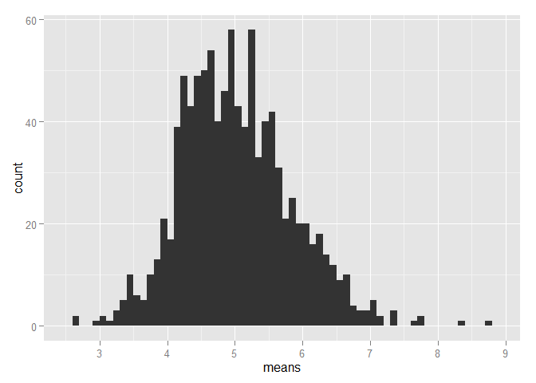
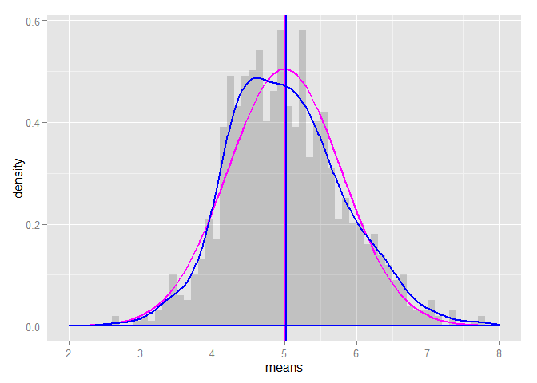

# Statistical Inference Project 1
fourlin88  
Monday, June 15, 2015  

#Simulation to compare exponential distibution and Central Limit Theorem

## Requirement
Here is the requirement for this project. 
I need to investigate the exponential distribution in R and compare it with the Central Limit Theorem. The exponential distribution can be simulated in R with rexp(n, lambda) where lambda is the rate parameter. The mean of exponential distribution is 1/lambda and the standard deviation is also 1/lambda. It is required to set lambda = 0.2 for all of the simulations. I will investigate the distribution of averages of 40 exponentials. As another requirement, I will need to do a thousand simulations.

## Simulations


```r
# load neccesary libraries
library(ggplot2)

# set constants
lambda <- 0.2 # lambda for rexp
n <- 40 # number of exponetials
nSimulation <- 1000 # number of tests

# set the seed to create reproducability
set.seed(1125556665)

# run the test resulting in n x nSimulation matrix
expDist <- matrix(data=rexp(n * nSimulation, lambda), nrow=nSimulation)
expDistMeans <- data.frame(means=apply(expDist, 1, mean))
```

 

## Sample Mean versus Theoretical Mean

The expected mean $\mu$ of a exponential distribution of rate $\lambda$ is 

$\mu= \frac{1}{\lambda}$ 


```r
mu <- 1/lambda
print(mu)
```

```
## [1] 5
```

Let $\bar X$ be the average sample mean of 1000 simulations of 40 randomly sampled exponential distributions.


```r
meanOfMeans <- mean(expDistMeans$means)
print(meanOfMeans)
```

```
## [1] 5.027155
```

The expected mean and the avarage sample mean are very close. 


## Sample Variance versus Theoretical Variance

The expected standard deviation $\sigma$ of a exponential distribution of rate $\lambda$ is 

$\sigma = \frac{1/\lambda}{\sqrt{n}}$ 


```r
sd <- 1/lambda/sqrt(n)
print(sd)
```

```
## [1] 0.7905694
```

The variance $Var$ of standard deviation $\sigma$ is

$Var = \sigma^2$ 


```r
Var <- sd^2
print(Var)
```

```
## [1] 0.625
```

suppose $Var_x$ be the variance of the average sample mean of 1000 simulations of 40 randomly sampled exponential distribution, and $\sigma_x$ the corresponding standard deviation.

```r
sd_x <- sd(expDistMeans$means)
print(sd_x)
```

```
## [1] 0.8154577
```

```r
Var_x <- var(expDistMeans$means)
print(Var_x)
```

```
## [1] 0.6649713
```

From the results, standard deviations are very close. 

## Distribution

Let us now compare the population means & standard deviation with a normal distribution of the expected values. Please see the following graphs. 
Special lines were added in the graph to differentiate between the population means and the simulation means. 


```r
# plot the means
ggplot(data = expDistMeans, aes(x = means)) + 
  geom_histogram(binwidth=0.1, aes(y=..density..), alpha=0.2) + 
  stat_function(fun = dnorm, arg = list(mean = mu , sd = sd), colour = "magenta", size=1) + 
  geom_vline(xintercept = mu, size=1, colour="magenta") + 
  geom_density(colour="blue", size=1) +
  geom_vline(xintercept = meanOfMeans, size=1, colour="blue") + 
  scale_x_continuous(breaks=seq(mu-3,mu+3,1), limits=c(mu-3,mu+3)) 
```

```
## Warning in loop_apply(n, do.ply): Removed 2 rows containing non-finite
## values (stat_density).
```

 

From the graph, the calculated distribution of means of random sampled exponantial distributions, overlaps quite nice with the normal distribution with the expected values based on the given lamba.


###References
Lecture notes, especially lecture number 7. 
